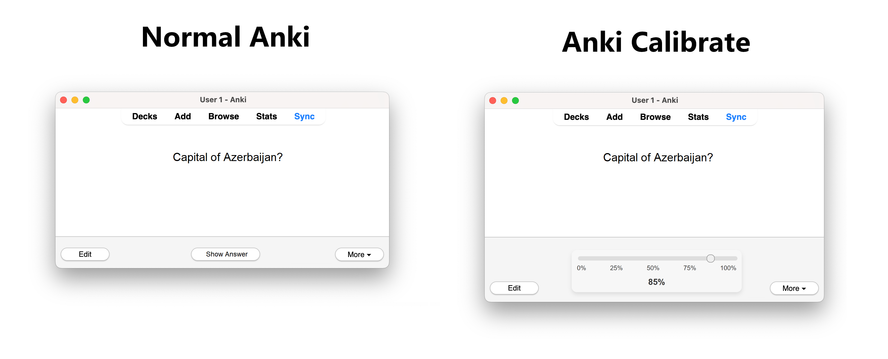

# Anki Calibrate

> “I'm 97% confident that the capital of Azerbaijan is Baku.” - Someone after learning capitals using Anki Calibrate

[Anki](https://apps.ankiweb.net/) is a popular flashcard software people use to study and remember facts about whatever they want. This add-on adds the challenge of trying to predict how likely you are to get the correct answer before it is revealed.

## What is 'calibration'?

[Calibration](https://en.wikipedia.org/wiki/Calibrated_probability_assessment) in this context means that if you are, say, 90% sure you know the answer, then you should actually end up being correct 90% of the time. The [overconfidence effect](https://en.wikipedia.org/wiki/Overconfidence_effect) is a well established bias in psychology according to which people in a wide range of scenarios are wildly too certain they have the right answer. In [one study](https://www.researchgate.net/profile/Ola-Svenson/publication/222465512_Are_We_All_Less_Risky_and_More_Skillful_than_our_Fellow_Drivers/links/5c07b072458515ae5447ed2d/Are-We-All-Less-Risky-and-More-Skillful-than-our-Fellow-Drivers.pdf), 93% of US respondents stated they are drivers than the median.

## How does this work?
Usually with Anki, you get shown the front of your flashcard, click "Show Answer", see the backside and then score yourself on whether your answer was correct. This add-on replaces the "Show Answer" button with a slider from 0% to 100% for you to predict how sure you are to have the right answer:

Then you score yourself as usual. After doing this a few hundred times, you can check if your sense of your own knowledge is accurate. Go to the tools menu and click "Calibration":

The chart displays how often you were actually correct, based on the confidence interval you selected: [0-9%], [10-19%], and so on, up to [90-100%]. It also includes a 50% confidence interval for each range. If you are calibrated, this should roughly follow the ideal diagonal marked in black. In red is an actual linear best fit. The difference in the two slopes is your overconfidence score. If you are perfectly calibrated this should be roughly 0. If it is larger, then you are overconfident. If it is lower, you are underconfident. The [Brier score](https://en.wikipedia.org/wiki/Brier_score) is another measure of how good you are at estimating your own accuracy. Less is better with 0% being the best.

## Usage Tips
You can use this add-on to get a calibrated sense of accuracy on your own personal flashcards. But you might also want to try downloading one of Anki's many [shared decks](https://ankiweb.net/shared/decks) made by other users to challenge yourself to make accurate forecast of other topics. Even if you have never studied different countries' capitals you will probably know many of them, and sort of know even more. So no matter how much you actually know, try downloading [a deck with capitals](https://ankiweb.net/shared/info/123449169) and see if your sense of your own geography knowledge is accurate.

Also, this is the kind of add-on you might just want to try out for a change rather than permanently. To get a decently looking calibration chart you really only need a few hundred probability estimates. Depending on your Anki usage this might only take a couple of days.

## Installations
You can download the newest version of the add-on here: <https://github.com/JulHeg/AnkiCalibrateAddon/releases/latest>. (This is still a bit work in progress and I'll also put it on the Anki website when done, TODO!)

You can also copy into your addon folder [manually for developing](https://addon-docs.ankiweb.net/addon-folders.html). In this case you also need to download the sole dependency [d3.js](https://cdn.jsdelivr.net/npm/d3@7) and put it into the src folder. You can also automatically build the .ankiaddon file with this command:
    curl -o src/d3_7.js https://cdn.jsdelivr.net/npm/d3@7
    zip -rj calibrate.ankiaddon src/*

## Limitations
This add-on only works for the desktop version of Anki, not for the web or smartphone app. The calibration data is only stored locally on your computer and not synced across devices. However, the Calibrate add-on does not interfere with Anki's normal functioning, so you can still study on your phone normally while using the add-on on your PC. This add-on was developed and tested with Anki version 24.06.3 and might not work with other versions.

## Thank yous
This add-on is heavily inspired by the [Anki with Uncertainty](https://www.quantifiedintuitions.org/anki-with-uncertainty) add-on by [Quantified Intuitions](https://www.quantifiedintuitions.org/) which prompts users to give confidence intervals on numerical questions. The calculation for the overconfidence score and the calibration plot is based on the awesome crowd prediction site [Metaculus](https://www.metaculus.com/questions/). You might also be interested in [other tools](https://www.quantifiedintuitions.org/calibration) to [help calibrate](https://www.openphilanthropy.org/calibration) yourself [on different tasks](https://saul-munn.notion.site/Learning-d3f941797ea740878862225581eb7949).

And of course I would be very happy to hear about any experiences, feedback or suggestions about the add-on: <me@juliushege.com>.